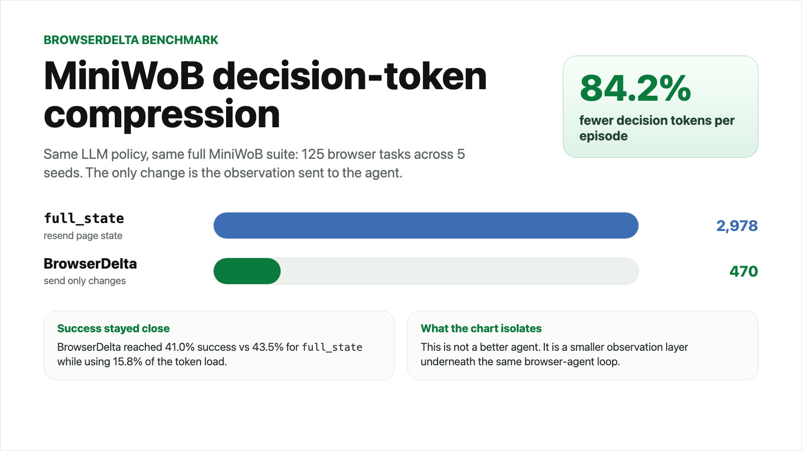

# BrowserDelta Devpost Benchmark Section

## Benchmarks

On MiniWoB, we ran compact observations against a full-state baseline using the
same LLM policy. BrowserDelta cut decision tokens from 2,978 to 470 on average,
an 84.2% reduction, while staying close on task success: 41.0% for BrowserDelta
vs 43.5% for `full_state`.

The important part is that the agent did not change. `full_state` resends a
large browser observation every step; BrowserDelta sends a compact diff: what
changed, which controls matter, and a crop only when pixels matter. This
isolates the observation layer underneath Browserbase, Playwright, or any
browser-use agent loop.

Source: `reports/demo/miniwob-5seed-summary/summary.json`, full MiniWoB suite
of 125 tasks across 5 seeds.
