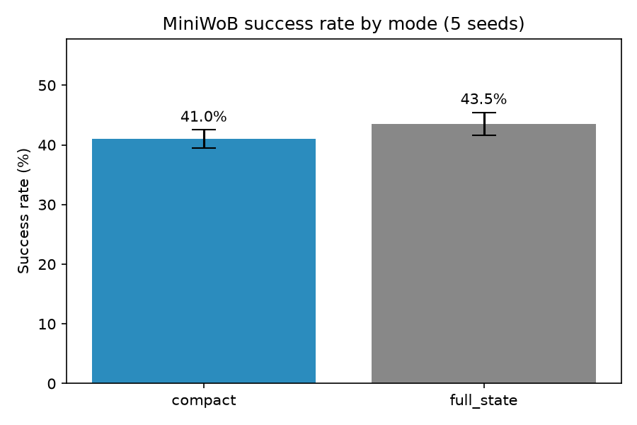
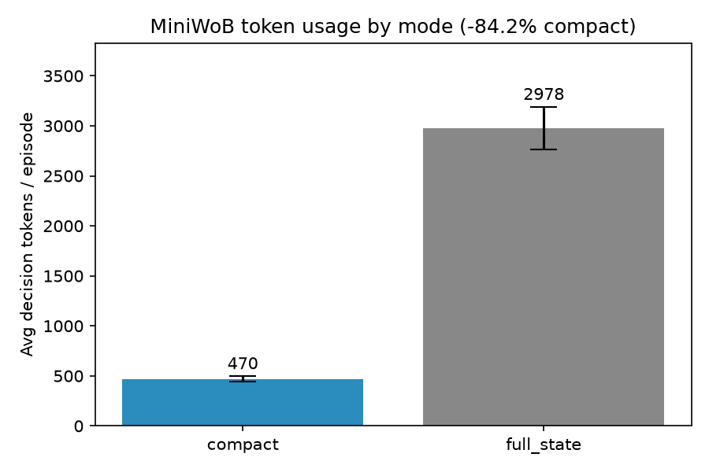
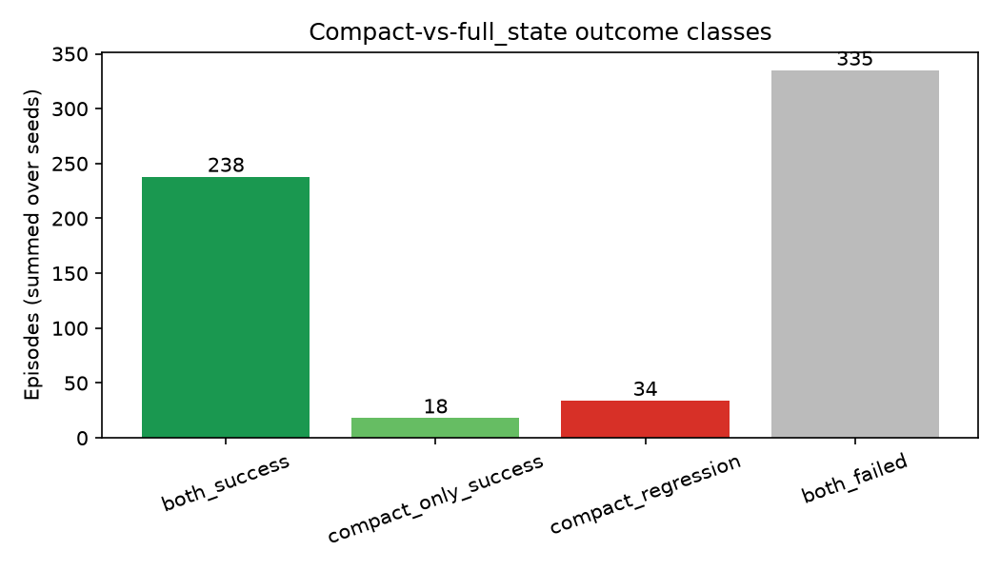

# MiniWoB 5-Seed BrowserDelta Benchmark

Compact (BrowserDelta) vs full_state observations on MiniWoB, policy=llm, headless, max-steps=8, seeds=1, 2, 3, 4, 5.

**Tasks per seed:** 125  
**Subset rule:** Full MiniWoB suite: all 125 registered browsergym/miniwob.* tasks per seed.

## Headline numbers (mean ± std across seeds)

| Metric | compact | full_state |
| --- | --- | --- |
| Success rate | 40.96% ± 1.55% | 43.52% ± 1.93% |
| Avg decision tokens | 469.88 ± 28.30 | 2978.32 ± 212.04 |

**Average token reduction (compact vs full_state):** 84.17% ± 1.16%

## Outcome classes (summed across seeds)

| Class | Episodes |
| --- | --- |
| both_success | 238 |
| compact_only_success | 18 |
| compact_regression | 34 |
| both_failed | 335 |

## Top compact regressions (by frequency across seeds)

| Task | Seeds regressed |
| --- | --- |
| browsergym/miniwob.email-inbox-reply | 4 |
| browsergym/miniwob.identify-shape | 4 |
| browsergym/miniwob.email-inbox-star-reply | 4 |
| browsergym/miniwob.email-inbox | 2 |
| browsergym/miniwob.email-inbox-delete | 2 |
| browsergym/miniwob.guess-number | 2 |
| browsergym/miniwob.find-word | 2 |
| browsergym/miniwob.multi-orderings | 2 |
| browsergym/miniwob.simple-arithmetic | 1 |
| browsergym/miniwob.copy-paste-2 | 1 |

## Top compact-only wins (by frequency across seeds)

| Task | Seeds won |
| --- | --- |
| browsergym/miniwob.click-tab-2 | 2 |
| browsergym/miniwob.click-tab-2-hard | 2 |
| browsergym/miniwob.count-sides | 2 |
| browsergym/miniwob.email-inbox-important | 2 |
| browsergym/miniwob.odd-or-even | 2 |
| browsergym/miniwob.click-collapsible-2 | 1 |
| browsergym/miniwob.click-collapsible-2-nodelay | 1 |
| browsergym/miniwob.click-tab-2-easy | 1 |
| browsergym/miniwob.click-tab-2-medium | 1 |
| browsergym/miniwob.email-inbox-delete | 1 |

## Per-seed detail

| Seed | Tasks | compact succ | full_state succ | compact tok | full_state tok | reduction |
| --- | --- | --- | --- | --- | --- | --- |
| 1 | 125 | 43.2% | 43.2% | 482 | 3227 | 85.1% |
| 2 | 125 | 40.8% | 42.4% | 498 | 3000 | 83.4% |
| 3 | 125 | 40.8% | 44.8% | 429 | 2629 | 83.7% |
| 4 | 125 | 41.6% | 46.4% | 497 | 2882 | 82.8% |
| 5 | 125 | 38.4% | 40.8% | 443 | 3154 | 86.0% |

## Charts

